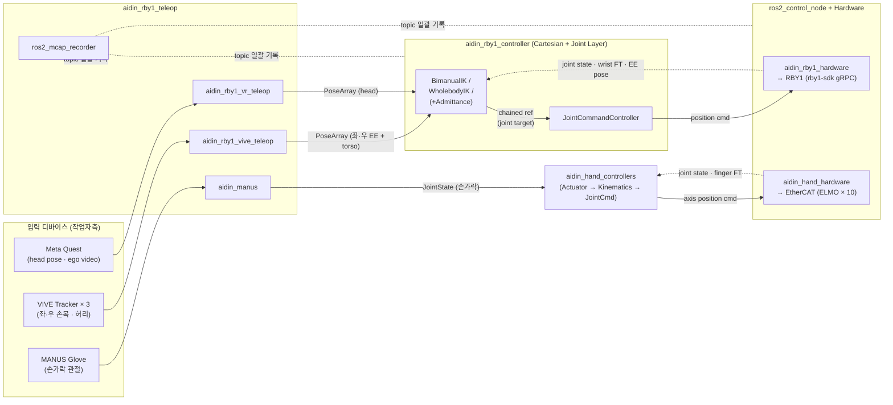

+++
title = "소프트웨어 아키텍처"
weight = 2
+++

본 시스템의 ROS 2 스택은 **Description → Hardware Interface → Controller** 세 계층으로 구성되며, 위로 텔레오퍼레이션 패키지 묶음이 얹히는 구조입니다. 모든 패키지는 ROS 2 Humble + ros2_control 위에서 동작합니다.

## ROS2 패키지 구성

### 1. Description (URDF / xacro)

| 패키지 | 역할 |
| --- | --- |
| `aidin_hand_description` | 5지 AIDIN Hand 의 URDF / xacro / 메쉬 / RViz · 좌·우 손 매크로, ros2_control 매크로, EtherCAT 슬레이브 PDO/SDO 매핑 (`welcon_slave.yaml`) 포함 |
| `aidin_rby1_description` | RBY1 + AIDIN Hand 통합 모델 (URDF / xacro / Mujoco MJCF / Isaac Sim USD / RViz). 외부 [`rby1_description`](https://github.com/RainbowRobotics/rby1-ros2) (베이스·관절 메쉬) 와 `aidin_hand_description` 을 매크로로 합성 |

### 2. Hardware Interface (ros2_control SystemInterface 플러그인)

URDF 의 `<ros2_control>` 블록에서 로드되며 자체 노드는 띄우지 않습니다.

| 패키지 | 제공 플러그인 | 비고 |
| --- | --- | --- |
| `aidin_hand_hardware` | `EtherlabDriver` (실기, IgH EtherCAT + CiA-402 + homing 시퀀스 내장, 1 kHz RT 루프) / `EthercatDriver` (`ethercat_interface` 기반 일반형) / `AidinHandVirtualHardware` (가상) | 5 손가락 × ELMO 슬레이브 1개 × 3축. axis1 에 F 센서, axis2 에 T 센서 |
| `aidin_rby1_hardware` | `RBY1HardwareInterface` (실기, [`rby1-sdk`](https://github.com/RainbowRobotics/rby1-sdk) gRPC 통신, 24 DoF + 좌·우 손목 FT + EE/torso/head pose state, 위치/임피던스 모드 + homing/E-stop 서비스) / `AidinRBY1VirtualHardware` (가상) | 별도 `rby1_description` 패키지(Rainbow 측) 의 URDF 도 런타임 로드함 |

### 3. Controller (ros2_control 컨트롤러)

| 패키지 | 주요 컨트롤러 | 설명 |
| --- | --- | --- |
| `aidin_hand_controllers` | `ActuatorController` → `HandKinematicsController` → `JointCommandController` (모두 `ChainableControllerInterface`) | 사용자 관절 명령 → 손가락 운동학 → 액추에이터 인코더로 chain 전파. 호밍 완료(`/aidin_hand/homing_done`) 후 `homing_activator.py` 가 후속 컨트롤러 자동 활성화. `joint_state` / 인코더 / 손가락 F-T 브로드캐스터 동반 |
| `aidin_rby1_controller` | **Joint layer**: `JointCommandController` (필수, terminal) **Cartesian layer** (택1): `BimanualIKController` / `WholebodyIKController` / `CartesianAdmittanceController` / `WholebodyCartesianAdmittanceController` **Mobile layer** (옵션): `diff_drive_controller` **Broadcaster**: joint_state, EE pose, torso/head pose, wrist FT, hand FT | Pinocchio FK/Jacobian + hpp-fcl self-collision. IK 내부 안전 레이어: joint-limit avoidance → posture preference → self-collision avoidance → hard joint clamp. `use_wholebody_control` / `use_admittance_control` launch 인자로 Cartesian 컨트롤러 자동 선택 |

### 4. Teleoperation (상위 스택)

| 패키지 | 역할 |
| --- | --- |
| `aidin_rby1_teleop` | VR HMD · VIVE Tracker · MANUS Glove 입력을 단일 ref frame 으로 정합 후 위 Cartesian / Joint / Hand 컨트롤러로 송출, 동시에 MCAP 으로 녹화 → RoboMimic HDF5 / LeRobot 자동 변환. 서브패키지: `aidin_rby1_teleop_bringup`, `aidin_rby1_vr_teleop`, `aidin_rby1_vive_teleop`, `aidin_manus`, `vive_tracker_ros2`, `ros2_mcap_recorder` |

## 런타임 데이터 플로우 (텔레옵 → 로봇)

## 주요 인터페이스

| 입력 토픽 (외부 → 컨트롤러) | 타입 | 흐름 |
| --- | --- | --- |
| `/aidin_rby1_bimanual_controller/pose_array_command` | `geometry_msgs/PoseArray` (좌 EE / 우 EE / torso) | VIVE Tracker → bimanual IK |
| `/aidin_rby1_joint_controller/joint_state_command` | `sensor_msgs/JointState` | Cartesian 우회, joint-space 직접 (homing 등) |
| `/aidin_rby1_mobile_controller/cmd_vel_unstamped` | `geometry_msgs/Twist` | 모바일 베이스 차동 구동 |
| `/hand_joint_controller/joint_state_command` | `sensor_msgs/JointState` | MANUS → 양손 손가락 각도 |

| 출력 토픽 (state · feedback) | 타입 |
| --- | --- |
| `/joint_states` | `sensor_msgs/JointState` |
| `/{side}_eef_pose_broadcaster/pose` | `geometry_msgs/PoseStamped` |
| `/{side}_wrist_ft_sensor_broadcaster/wrench` | `geometry_msgs/WrenchStamped` |
| `/{side}_ft_sensor_broadcaster/wrench` | `sensor_msgs/MultiDOFJointState` (5 손가락 묶음) |
| `/{side}_{finger}_ft_sensor_broadcaster/wrench` | `geometry_msgs/WrenchStamped` (손가락별) |

| 서비스 | 타입 | 용도 |
| --- | --- | --- |
| `/{cartesian_controller}/home_to_initial` | `std_srvs/Trigger` | (1) controller deactivate → (2) `~/home_to_initial` (HW) → (3) reactivate |
| `/rby1_hw_node/emergency_stop` | `std_srvs/Trigger` | PowerOff → Disconnect → controller_manager 종료 |

## 외부 의존성 요약

- **ROS 2**: Humble, `ros2_control`, `ros2_controllers`, `controller_manager`, `realtime_tools`, `joint_state_broadcaster`, `force_torque_sensor_broadcaster`, `pose_broadcaster`, `diff_drive_controller`
- **하드웨어 드라이버**: IgH **EtherCAT Master** (AIDIN Hand), [`rby1-sdk`](https://github.com/RainbowRobotics/rby1-sdk) (RBY1 측)
- **기구학·충돌**: **Pinocchio** (FK / Jacobian), **hpp-fcl** (self-collision distance)
- **외부 description**: Rainbow Robotics 의 `rby1_description` (메쉬·URDF)

